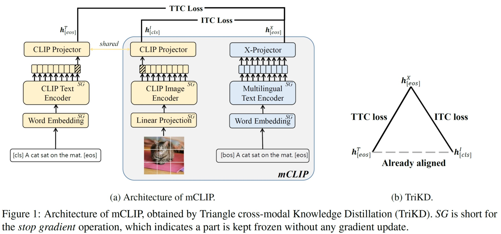
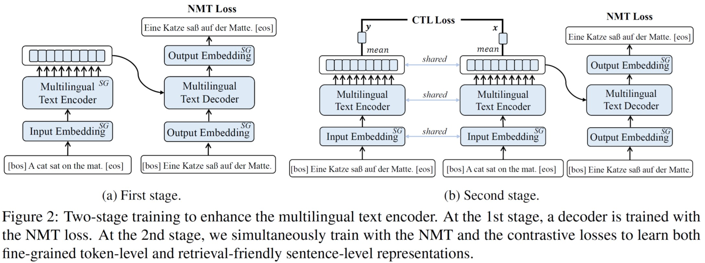

# mCLIP: multilingual CLIP

Code for ACL 2023 long paper "mCLIP: Multilingual CLIP via Cross-lingual Transfer" [[paper](https://aclanthology.org/2023.acl-long.728/)]

## Key Idea

We propose mCLIP, a retrieval-efficient dual-stream multilingual VLP model. It is trained by aligning the CLIP model and a Multilingual Text Encoder (MTE) through a novel Triangle Cross-modal Knowledge Distillation (TriKD) method. It is parameter-efficient as only two light projectors on the top of them are updated during distillation. 



Furthermore, to enhance the token- and sentence-level multilingual representation of the MTE, we propose to train it with machine translation and contrastive learning jointly **before** the TriKD to provide a better initialization. 



Empirical results on MSCOCO and Multi30K dataset show that our mCLIP+ model achieves new state-of-the-art performance in the multilingual image-text retrieval task.


## (1) Setup

The code is based on [fairseq v0.10.2](https://github.com/facebookresearch/fairseq/tree/v0.10.2). The official repo provides more details about the instructions and examples about fairseq toolkit. After clone this repo, following the next steps to replicate the experiments in the paper.

```bash
# activate your conda environment
cd /path/to/this/code
python -m pip install -e . --user   
python setup.py build_ext --inplace

# install the official CLIP package 
pip install -e scripts/CLIP/
```

## Dataset Processing

We collect the parallel sentences from the urls in the appendix and binarize the data in the `scripts/preprocess.sh`.

We collect the image-text pairs from CC3M and MSCOCO/Multi30K. Then we preprocess the data in the `scripts/preprocess.sh`. 

Before training, download the official XLM-R checkpoint and tokenizer from [here](https://github.com/facebookresearch/fairseq/tree/main/examples/xlmr) and put them under the path `$workloc/models/xlmr_base/`. Similarly, download the official CLIP checkpoiont and put them under the path `$workloc/models/clip_base/`.

## Step1: Train the enhanced multilingual text encoder with two-stage training

See more details in  `scripts/run_mte.sh`.

## Step 2: Train the mCLIP model with Triangle Cross-modal Knowledge Distillation 

See more details in `scripts/run_mclip.sh`.

## Pretrained mCLIP checkpoints

* [mCLIP base](https://huggingface.co/SUSTech-NLP/mclip_base/blob/main/mclip_base.pt)
* [mCLIP+ base](https://huggingface.co/SUSTech-NLP/mclip_base/blob/main/mclip_plus_base.pt)

The checkpoints are available on [Huggingface](https://huggingface.co/SUSTech-NLP/mclip_base). After downloading the checkpoints, put them under your work location `$workloc/models/xlmr_base/`.

## Fine-Tuning on Downstream Tasks

More details are in `scripts/run_mclip.sh`.

## Citation

If you find this repository useful, please consider citing our work:

```
@inproceedings{chen2023mclip,
    title = "{mCLIP}: Multilingual CLIP via Cross-lingual Transfer",
    author = "Chen, Guanhua  and  Hou, Lu and Chen, Yun and Dai, Wenliang and
      Shang, Lifeng and Jiang, Xin and Liu, Qun and Pan, Jia and Wang, Wenping",
    booktitle = "Proceedings of ACL",
    month = july,
    year = "2023",
    address = "Toronto, Canada",
}

```

### Contact Information

For help or issues using mCLIP models, please submit a GitHub issue.
